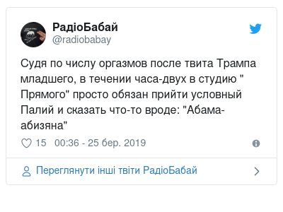
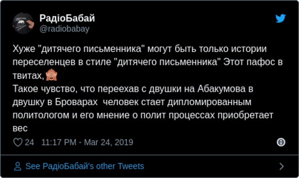
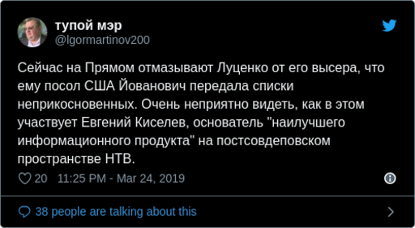

# Twits As Images
Automatically produces beautiful screenshots from any tweets.

## Install

### Requirements

 - Python 3.7 or higher
 - PhantomJS or ChromeDriver
 
### Optional dependencies

 - ImageMagick for image postprocessing
 - PyGTK for GUI (available only in Linux!)
 
### Installation

Requirements can be installed using binary files:

 - [Python 3.7](https://www.python.org/downloads/) for Windows & Mac OS X. Use your Linux distribution package manager or [pyenv](https://github.com/pyenv/pyenv) for install Python on Linux.
 - [PhantomJS binary releases](https://github.com/ariya/phantomjs/releases). Just unzip `phantomjs` or `phantomjs.exe` executable file to project directory.
 - [ChromeDriver binary releases](http://chromedriver.chromium.org/downloads), you also need Google Chrome (or Chromium) on your machine. Select version, that related to your browser.

After installing requirements, just run in your command shell (bash or PowerShell):
```bash
# pip install pipenv
# pipenv install
```

## Usage

### CLI for one tweet

Lets' get some simple tweet from your feed.

<blockquote class="twitter-tweet" data-lang="ru"><p lang="ru" dir="ltr">Судя по числу оргазмов после твита Трампа младшего, в течении часа-двух в студию &quot; Прямого&quot; просто обязан прийти условный Палий и сказать что-то вроде: &quot;Абама-абизяна&quot;</p>&mdash; РадіоБабай (@radiobabay) <a href="https://twitter.com/radiobabay/status/1109932072796336128?ref_src=twsrc%5Etfw">24 марта 2019 г.</a></blockquote>

Here is the [URL](https://twitter.com/radiobabay/status/1109932072796336128).

For saving this twit as image, just run:

```bash
$ ./socialscreen shot --destination images/ --filename example-simple.png https://twitter.com/radiobabay/status/1109932072796336128
```

Make sure, that you have installed [PhantomJS](https://github.com/ariya/phantomjs/releases).

Here we can see example of inserted file:



File will be located at *images/images/example-simple.png*.

### Advanced CLI

CLI have two commands: `process` and `shot`. Here are descriptions of these commands.

```
$ ./socialscreen shot --help
Usage: cli.py shot [OPTIONS] [TWEETS]...

  Screenshots and saves tweet(s), that passed as parameter(s).

Options:
  -c, --config-file PATH  configuration file
  -d, --debug             debug output mode
  -d, --destination PATH  folder to download image(s)
  -f, --filename TEXT     filename or filename template
  --help                  Show this message and exit.

```

```
$ ./socialscreen process --help
Usage: cli.py process [OPTIONS] TWEETS_FILE

  Processes JSON file with tweets.

Options:
  -c, --config-file PATH  configuration file
  -d, --debug             debug output mode
  -d, --destination PATH  folder to download image(s)
  -f, --filename TEXT     filename or filename template
  -w, --write-changes     write changes to JSON file with tweets
  -u, --update            update tweet images, if they are already exist
  --help                  Show this message and exit.
```

Let's show all these options in one command:

```bash
$ ./cli process --config-file examples/config.chrome.json --debug --destination images/ --filename "example-complex-{no}.png" --write-changes --update examples/tweets.json
```

And here are the examples:





Generated configuration will be located [here](examples/twits.output.json).

## Configuration

Genration and postprocessing parameters are configures by `config.json` file. 

File contains 4 sections:

| Section            	| Description                                             	|
|--------------------	|---------------------------------------------------------	|
| _headless_browser_ 	| settings of headless browser	                            |
| _twit_embed_       	| settings of embedding Twitter                           	|
| _download_         	| image download settings                                  	|
| _postprocess_      	| image postprocess settings (**required ImageMagick!**)  	|

###  Configuration for headless browsers

PhantomJS

```json
{
    "headless_browser": {
        "name": "phantomjs",
        "executable_path": "./phantomjs"
    }
}
```

Chrome

```json
{
    "headless_browser": {
        "name": "chrome",
        "executable_path": "./chromedriver"
    }
}
```

### Configuration of twit embed

Example of dark theme, _English_ interface language and thread in Twitter timeline:

```json
{
    "twit_embed": {
        "hideConversation": "off",
        "theme": "dark",
        "lang": "en",
        "hide_thread": "false"
    }
}
```

Example of light theme, _Ukrainian_ interface language and only twit:
```json
{
    "twit_embed": {
        "hideConversation": "on",
        "theme": "light",
        "lang": "uk",
        "partner": "",
        "hide_thread": "true",
        "height": "512"
    }
}
```

See [Embedded Tweet parameter reference
](https://developer.twitter.com/en/docs/twitter-for-websites/embedded-tweets/guides/embedded-tweet-parameter-reference) for details.

### Configuration of download

Example:

```json
{
    "download": {
        "path": "images",
        "template": "example-complex-{no}.png"
    }
}
```

Template supports these substitutions:

| Tag      	| Description                                                     	|
|----------	|-----------------------------------------------------------------	|
| {id}     	| Twit id                                                         	|
| {author} 	| Twit author slug                                                	|
| {random} 	| random 8-digit string with digits and lowercase letters         	|
| {no}     	| number of same image, image_{no}.png and image_1.png as example 	|


### Configuration of post-processing

Example:
```json
{
    "postprocess": {
        "trim": true,
        "resize": true,
        "resize_options": {
            "width": "512"
        }
    }
}
```

There are two available operations:
- trim - trims image using alpha-channel
- resize - resizes image respecting aspect ratio
     - width
     - height


## Example twits.json

```json
{
    "twits": [
        {
            "url": "https://twitter.com/lgormartinov200/status/1109914138602602496",
            "emoji": "",
            "image": "./images/example-complex-1.png",
            "text": "Сейчас на Прямом отмазывают Луценко от его высера, что ему посол США Йованович передала списки неприкосновенных. Очень неприятно видеть, как в этом участвует Евгений Киселев, основатель \"наилучшего информационного продукта\" на постсовдеповском пространстве НТВ."
        },
        {
            "url": "https://twitter.com/radiobabay/status/1109917532000006146",
            "emoji": "",
            "image": "./images/example-complex-1.png",
            "text": "Србе на врбе pic.twitter.com/nbATerijLE"
        },
        {
            "url": "https://twitter.com/radiobabay/status/1109912244421345282",
            "emoji": "",
            "image": "./images/example-complex-1.png",
            "text": "Хуже \"дитячего письменника\" могут быть только истории переселенцев в стиле \"дитячего письменника\" Этот пафос в твитах,🙈\nТакое чувство, что переехав с двушки на Абакумова в двушку в Броварах человек стает дипломированным политологом и его мнение о полит процессах приобретает вес"
        }
    ]
}
```
     
## Changelog

### Version 0.2
 - Updated CLI using `click` library
 

### Version 0.1
 - First version
